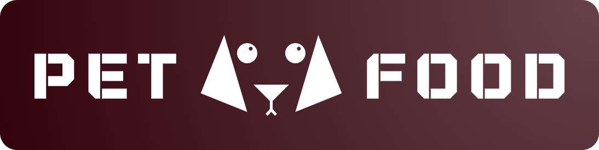

# Kvalifikācijas darbs
{: height="50px"}
## Pieejams:
[petfood.brakis.id.lv](https://petfood.brakis.id.lv/)
### Testa lietotāji:
#### Administrators
USER: kaarlisbrakis@gmail.com
PASS: 12345678
#### Lietotājs
USER: ip20.k.brakis@vtdt.edu.lv
PASS: 12345678
### Datu bāze:
[phpmyadmin.brakis.id.lv](https://phpmyadmin.brakis.id.lv/)

## Local setup
1. Clone this repo
```
git clone https://github.com/karluga/petfood .
```
2. Install dependencies
```
composer install (est. 2-5min)
```
3. Rename `.env.example` to `.env`
4. Generate app key (for security)
```
php artisan key:generate
```
5. Add MySQL database credentials to `.env` file.
Credentials from Gmail SMTP free mail service (from their server)
 - They can be created in your google account.
 - [Google Account](https://myaccount.google.com/) -> Security -> 2-Step Verification (2FA) -> App Passwords
 - Delete the whitespaces from the password before pasting it in the `.env` file.
 - P.S. they let you see it <u>only once!</u>
 - [YT tutorial](https://www.youtube.com/watch?v=1YXVdyVuFGA&ab_channel=Sombex)
6. Migrations 
```
php artisan migrate
```
7. Make a storage link and add write/read/delete permissions for `storage/` folder.
```
php artisan storage:link
# In linux
sudo chmod -R 777 storage
```

## Notes
### NOTE 1
To be able to test the app locally, you have to make a tunnel for Google OAuth login service.
1. Make an [Ngrok](https://ngrok.com/download) account.
2. Follow the steps to make a "tunnel" because google doesnt allow requests from localhost.
Run this in the ngrok command line tool and it will give you a URL for testing. It works until you close the commandline (probably)
```
ngrok http http://localhost:8000

```
Then you have to add these lines to the `.env` file used in `config/services.php`.
```
# Facebook OAuth Configuration
FACEBOOK_CLIENT_ID=XXX
FACEBOOK_CLIENT_SECRET=XXX
FACEBOOK_REDIRECT_URI=https://2607-2a03-ec00-b19b-19d4-14d2-8d38-f5fa-4400.ngrok-free.app/facebook/callback/

# Google OAuth Configuration
GOOGLE_CLIENT_ID=XXX
GOOGLE_CLIENT_SECRET=XXX
GOOGLE_REDIRECT_URI=https://2607-2a03-ec00-b19b-19d4-14d2-8d38-f5fa-4400.ngrok-free.app/google/callback/
```
3. [Link to Google Cloud console](https://console.cloud.google.com/apis/credentials)
Here you have to add the Ngrok generated URL to the "Authorized redirect URIs" section.
4. I have to warn you that you can only access the app from your new Ngrok URL.
*For the real web server you will need to add the current app URI.

### NOTE 2
To fix the problem with SSL in `vendor/guzzlehttp/guzzle/src/Client.php`
```
$defaults = [
    'allow_redirects' => RedirectMiddleware::$defaultSettings,
    'http_errors' => true,
    'decode_content' => true,
    'verify' => false,
    'cookies' => false,
    'idn_conversion' => false,
];
```
### NOTE 3
By default laravel doesnt use `MyISAM` database engine. I changed it to `config/database.php` because i had problems with `InnoDB`.
## Server setup
### Using Apache
1. Move all the code to server folder
2. Make an alias from "/" to "/public".
Inside Webmin:
Servers -> Apache Webserver -> petfood.brakis.id.lv -> Edit Directives
```
DocumentRoot /var/www/html/karlis/petfood.brakis.id.lv/petfood/public
ServerName petfood.brakis.id.lv


<Directory /var/www/html/karlis/petfood.brakis.id.lv/petfood>
    AllowOverride All
</Directory>
```
3. Give permissions to storage (this will grant access to `storage/logs/laravel.log` )
```
sudo chmod -R 777 storage
```
## Useful commands
```
# Clear application cache
php artisan cache:clear

# Clear configuration cache
php artisan config:clear

# Clear route cache
php artisan route:clear

# Clear view cache
php artisan view:clear
```